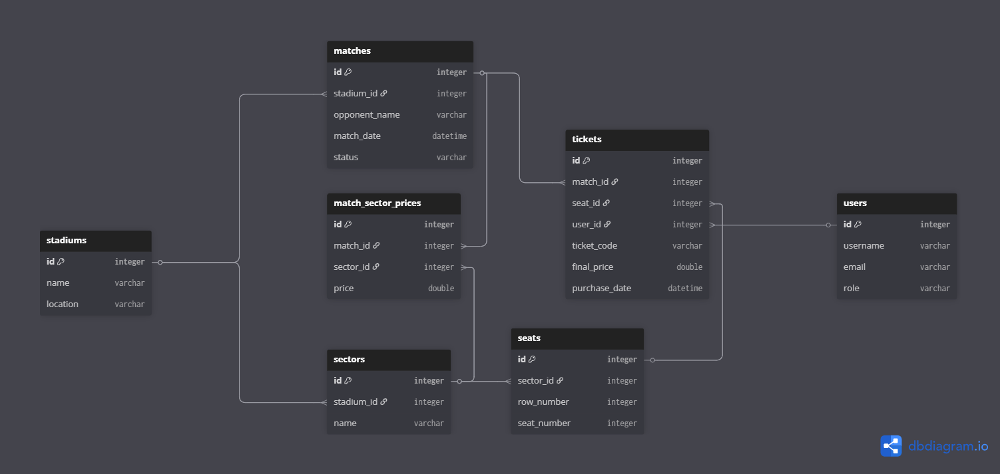

# Arena Ticketing System

Sistem backend pentru gestionarea vânzărilor de bilete la evenimente sportive, dezvoltat în Spring Boot.

## Tehnologii și Framework-uri
* **Limbaj:** Java 21
* **Framework:** Spring Boot 3.x
* **Persistență:** Spring Data JPA / Hibernate
* **Bază de date:** H2 (In-memory)
* **Utilitare:** Lombok, ModelMapper, Spring Scheduler

## Arhitectură Sistem
Proiectul este structurat pe straturi (Layered Architecture):
* **Controller:** Expune endpoint-urile REST.
* **Service:** Conține logica de business și validările.
* **Repository:** Gestionează interacțiunea cu baza de date prin interfețe JPA.
* **Model (Entity):** Definește structura tabelelor și relațiile (1:N, M:N).

## Funcționalități Implementate
* **Gestiune Infrastructură:** Configurare stadioane, sectoare și locuri.

* **Logica de Ticketing:**
    * Achiziție bilete cu verificarea automată a disponibilității locului.
    * Validări de preț bazate pe configurația specifică Meci-Sector.

## Structura Bazei de Date (ERD)
